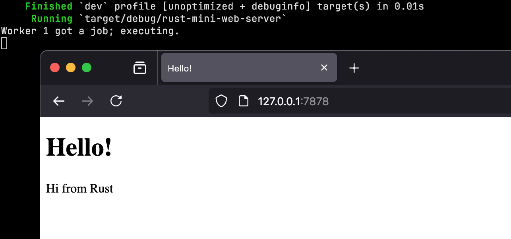

# Rust Mini Web Server

Example Rust multi-threaded web server. 📡

 

This project follows the web server implementation at the end of The Rust Programming Language book, but with improved error handling (no more `unwrap()`).

I’ve completed the Rust Book cover to cover and built this project as a hands-on exercise to reinforce my understanding of systems programming, concurrency, and networking in Rust.

The server handles 2 basic HTTP requests, serves static HTML pages, then gracefully shuts down.

🚧 **Not Production-Ready** - This is a learning project, not a full-fledged web server. In real-world applications, optimized async frameworks like Tokio + Hyper or Actix Web are used for performance and scalability.
